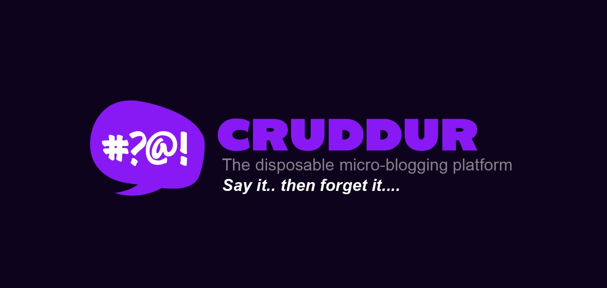
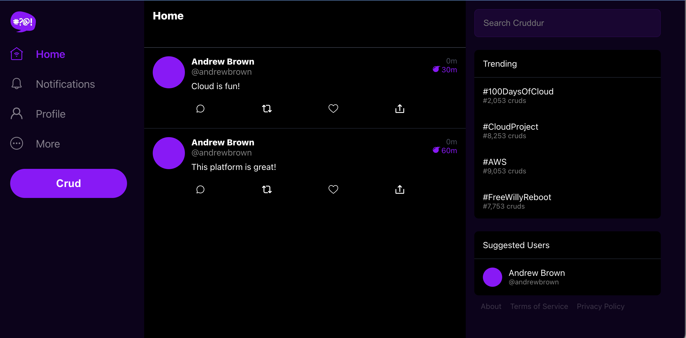
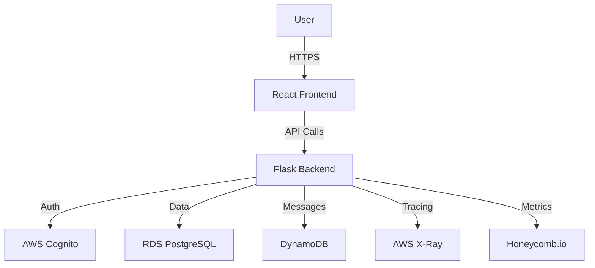

# 🚀 Cruddur — Full AWS Cloud Deployment




**Cruddur** is a cloud-native social media application built during the **AWS Cloud Project Bootcamp 2023**. It demonstrates a full-stack serverless architecture using AWS services, containerization, and modern observability tools.



---

## 🏗️ Architecture

### High-Level Flow
1. **Frontend:** React app hosted on S3/CloudFront or Containerized.
2. **Backend:** Flask API running on **AWS ECS Fargate**.
3. **Database:** **RDS Aurora (PostgreSQL)** for relational data and **DynamoDB** for messaging.
4. **Auth:** **Amazon Cognito** (User Pools) for JWT management.
5. **Observability:** Distributed tracing with **X-Ray** and **Honeycomb**.


### System Diagram

```text
                        ┌───────────────────────────────┐
                        │           Users / Browser     │
                        │        (Web / Mobile UI)      │
                        └───────────────┬───────────────┘
                                        │ HTTPS
                                        ▼
                 ┌──────────────────────────────────────────────┐
                 │                API Gateway                   │
                 │      + Lambda Authorizer (JWT validation)    │
                 └───────────────┬──────────────────────────────┘
                                 │
                                 ▼
                    ┌─────────────────────────────────┐
                    │        ECS Fargate Service      │
                    │     (backend-flask container)   │
                    └───────────────┬─────────────────┘
                                    │
                    ┌───────────────┼──────────────────────────────┐
                    │               │                              │
                    ▼               ▼                              ▼
      ┌───────────────────┐   ┌───────────────────┐    ┌───────────────────┐
      │   Amazon RDS      │   │   Amazon DynamoDB │    │   Amazon Cognito  │
      │  (PostgreSQL)     │   │ (Messages/Groups) │    │ (Auth / JWT)      │
      └───────────────────┘   └───────────────────┘    └───────────────────┘
                                    │
                                    ▼
            ┌─────────────────────────────────────────────────────────┐
            │                 Observability / Monitoring              │
            │  CloudWatch Logs  |  AWS X-Ray  |  Honeycomb (OTel)     │
            └─────────────────────────────────────────────────────────┘

```

---

## ☁️ Services Used

* **Compute:** Amazon ECS (Fargate), AWS Lambda
* **Database:** Amazon RDS (PostgreSQL), Amazon DynamoDB
* **Auth:** Amazon Cognito (User Pool)
* **API:** Amazon API Gateway
* **Observability:** AWS X-Ray, CloudWatch Logs, Honeycomb (OpenTelemetry), Rollbar
* **IaC:** AWS CloudFormation
* **CI/CD:** AWS CodePipeline, CodeBuild

---

## 📂 Project Structure

```text
aws-bootcamp-cruddur-2023/
│
├── docker-compose.yml              # Local docker dev config
├── backend-flask/                  # Flask backend API
├── frontend-react-js/              # React frontend app
├── aws/                            # AWS Infrastructure
│   ├── cfn/                        # CloudFormation templates
│   ├── lambdas/                    # Lambda functions
│   └── task-definitions/           # ECS Task Definitions
├── bin/                            # Helper CLI scripts for deployment
└── journal/                        # Learning journal & notes

```

---

## 🧪 Local Development

### Prerequisites

* [Docker Desktop](https://www.google.com/search?q=https://www.docker.com/products/docker-desktop)
* [AWS CLI](https://www.google.com/search?q=https://aws.amazon.com/cli/)
* Python 3.x & Node.js (Optional, for local debugging without Docker)

### 1. Clone the Repo

```bash
git clone [https://github.com/your-username/aws-bootcamp-cruddur-2023.git](https://github.com/your-username/aws-bootcamp-cruddur-2023.git)
cd aws-bootcamp-cruddur-2023

```

### 2. Configure Environment Variables

Create a `.env` file in the root directory (see [Environment Variables](https://www.google.com/search?q=%23-environment-variables) section below for details).

### 3. Run with Docker Compose

```bash
docker compose up --build

```

### 4. Access the App

* **Frontend:** [http://localhost:3000](https://www.google.com/search?q=http://localhost:3000)
* **Backend:** [http://localhost:4567](https://www.google.com/search?q=http://localhost:4567)
* **DynamoDB Local:** [http://localhost:8000](https://www.google.com/search?q=http://localhost:8000)

To stop the containers:

```bash
docker compose down

```

---

## 🔐 Environment Variables

Refer to `.env.example` for a complete list.

### Backend (`backend-flask`)

| Variable | Description |
| --- | --- |
| `AWS_DEFAULT_REGION` | AWS Region (e.g., `us-east-1`) |
| `AWS_ACCESS_KEY_ID` | IAM User Key |
| `AWS_SECRET_ACCESS_KEY` | IAM User Secret |
| `PROD_CONNECTION_URL` | PostgreSQL Connection String |
| `AWS_USER_POOL_ID` | Cognito User Pool ID |
| `AWS_USER_POOLS_WEB_CLIENT_ID` | Cognito App Client ID |
| `OTEL_EXPORTER_OTLP_HEADERS` | Honeycomb API Key |

### Frontend (`frontend-react-js`)

| Variable | Description |
| --- | --- |
| `REACT_APP_BACKEND_URL` | URL of the Flask API |
| `REACT_APP_AWS_PROJECT_REGION` | AWS Region |
| `REACT_APP_AWS_USER_POOLS_ID` | Cognito User Pool ID |
| `REACT_APP_API_GATEWAY_ENDPOINT_URL` | API Gateway URL (if used) |

---

## 🚀 AWS Deployment

This project uses **CloudFormation** and **Bash scripts** located in `bin/` and `aws/cfn/` to provision infrastructure.

### 1. Configure AWS CLI

```bash
aws configure

```

### 2. Provision Infrastructure Layers

Run the scripts in the following order:

1. **Networking:** VPC, Subnets, Internet Gateways.
```bash
./bin/cfn/networking-deploy

```


2. **Database:** RDS PostgreSQL instance.
```bash
./bin/cfn/db-deploy

```


3. **Cluster:** ECS Cluster and ALB.
```bash
./bin/cfn/cluster-deploy

```


4. **Service:** Deploy Backend and Frontend tasks to Fargate.
```bash
./bin/cfn/service-deploy

```


---

## 🔌 API Endpoints

### Health

* `GET /api/health-check` - Verify backend status.

### Activities (Posts)

* `GET /api/activities/home` - Main feed.
* `GET /api/activities/@<handle>` - User profile feed.
* `POST /api/activities` - Create a new post.

### Messaging

* `GET /api/message_groups` - List conversation threads.
* `POST /api/messages` - Send a direct message.

---

## 📡 Observability

This project implements full-stack observability:

* **Logs:** All application logs are streamed to CloudWatch Logs group `/cruddur`.
* **Tracing:**
* **AWS X-Ray:** Traces requests through the ECS containers.
* **Honeycomb:** OpenTelemetry instrumentation for deep debugging.


* **Errors:** **Rollbar** captures backend exceptions.

---

## 🛠️ Troubleshooting

**Common Issues:**

1. **CORS Errors:**
* Ensure `FRONTEND_URL` and `BACKEND_URL` environment variables match exactly.
* Check Flask `cors` configuration in `app.py`.


2. **Database Connection Failed:**
* Ensure the RDS Security Group allows inbound traffic from the ECS Service Security Group.
* Verify the `PROD_CONNECTION_URL` format.


3. **Auth Token Invalid:**
* Check that the `AWS_USER_POOL_ID` matches your Cognito setup.
* Ensure the frontend is sending the `Authorization: Bearer <token>` header.


---

## 📜 License

This project is part of the AWS Cloud Project Bootcamp 2023.

```


```
